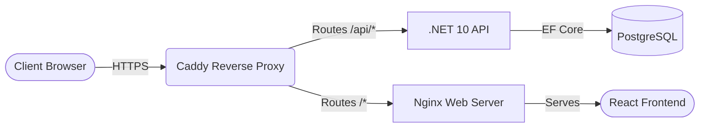
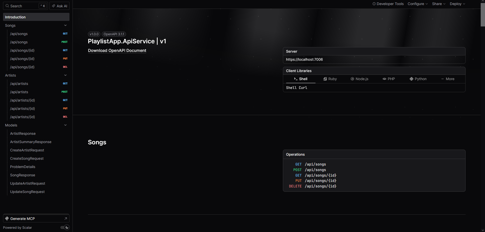
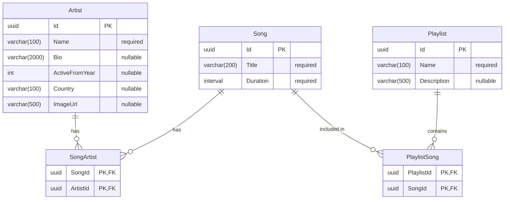
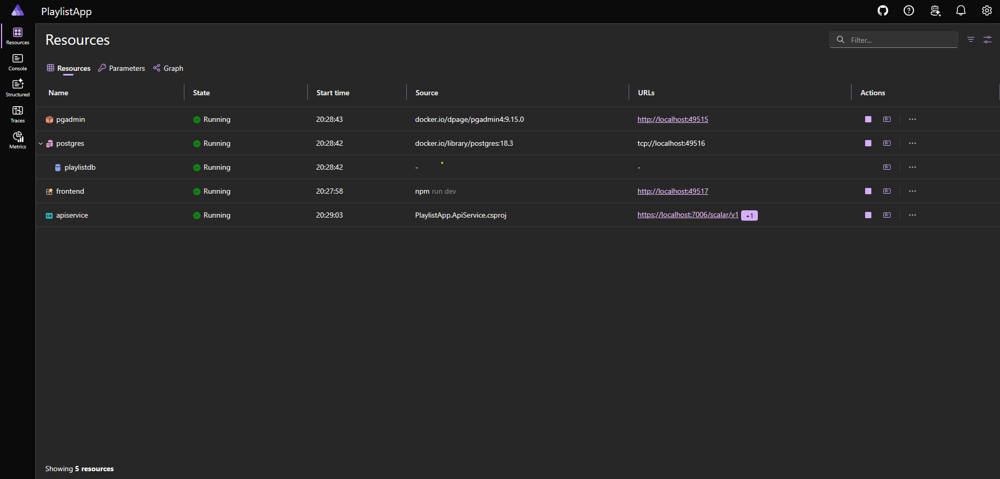
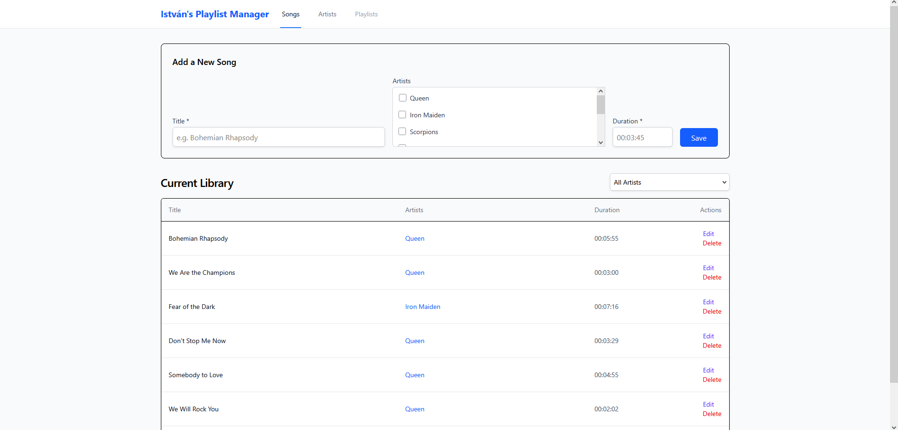
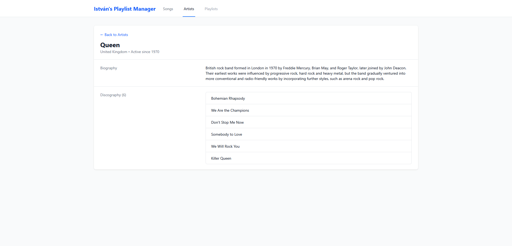

# István's Playlist Manager

[](https://github.com/istvan-karsai/aspire-playlist-app/actions/workflows/ci.yaml)
[](https://github.com/istvan-karsai/aspire-playlist-app/actions/workflows/cd.yaml)

**Live Application:** [playlist.istvankarsai.com](https://playlist.istvankarsai.com)

Project tracking, active issues, and the current sprint backlog are publicly visible:

- [Kanban Board](https://github.com/users/istvan-karsai/projects/1)
- [Issue Tracker](https://github.com/istvan-karsai/aspire-playlist-app/issues)

A modern, decoupled web application for managing music playlists, users, and artists. This project serves as a showcase of a production-ready .NET architecture, demonstrating container orchestration, full-stack typed contracts, and rigorous quality assurance standards.

## Table of Contents

- [Project Overview](#project-overview)
- [Architecture & Tech Stack](#architecture-tech-stack)
- [Repository Structure](#repository-structure)
- [System Configuration](#system-configuration)
- [Prerequisites](#prerequisites)
- [Setup & Execution](#setup-execution)
- [Testing Strategy](#testing-strategy)
- [DevOps & Workflow](#devops-workflow)
- [Project Roadmap](#project-roadmap)

## <a id="project-overview"></a>Project Overview

**Current Milestone: MVP (v0.1.0)**  
Playlist Manager is designed to handle relational music data efficiently. The backend is built to ensure strict validation, safe data parsing, and seamless database migrations, while the frontend consumes these APIs via a responsive, component-driven React interface.

## <a id="architecture-tech-stack"></a>Architecture & Tech Stack

- **Backend:** C# / ASP.NET Core Minimal APIs, Entity Framework Core
- **Frontend:** React, TypeScript, Vite, TanStack Query
- **Database:** PostgreSQL
- **Orchestration:** .NET Aspire, Docker, Caddy
- **Quality Assurance:** xUnit (Integration), Vitest & React Testing Library (Frontend), Playwright (E2E)

### System Architecture

The application is deployed via a containerized micro-architecture. Caddy acts as a secure reverse proxy at the edge, routing external traffic to the isolated backend API and the Nginx web server, which hosts the static React Single Page Application (SPA).



### API Documentation

The API surface is documented interactively via Scalar, allowing for seamless endpoint testing and typed contract discovery.

<div align="center">
  
  <br />
  <sub><em>Interactive OpenAPI specification rendered by Scalar.</em></sub>
</div>

### Database Schema

The application utilizes a normalized relational schema.



## <a id="repository-structure"></a>Repository Structure

```text
aspire-playlist-app/
├── .devcontainer/                  # Automated VS Code container environments
├── .github/workflows/              # CI/CD pipelines (Build, Test, Deploy)
├── .husky/                         # Local Git hooks (Commitlint)
├── PlaylistApp.AppHost/            # .NET Aspire orchestrator
├── PlaylistApp.ServiceDefaults/    # Shared telemetry, health checks, and DI
├── PlaylistApp.ApiService/         # C# ASP.NET Core minimal API & data access layer
├── PlaylistApp.Web/                # React frontend (Vite/TypeScript)
├── PlaylistApp.Tests.Integration/  # Backend xUnit integration tests
└── PlaylistApp.Tests.E2E/          # Playwright end-to-end testing suite
```

## <a id="system-configuration"></a>System Configuration

This repository utilizes centralized configurations to enforce consistency across all internal projects:

- **`Directory.Build.props`:** Centralizes MSBuild configurations, enforcing strict nullability, implicit usings, and standardizing the C# language version across the entire solution.
- **`Directory.Packages.props`:** Implements Central Package Management (CPM). This guarantees that all projects reference the exact same version of external NuGet dependencies, preventing version drift.
- **`.editorconfig`:** Enforces strict C# and TypeScript coding standards to maintain uniformity across the codebase.

## <a id="prerequisites"></a>Prerequisites

**Option A: Zero-Install Setup (Recommended)**  
This repository is fully configured for [DevContainers](https://code.visualstudio.com/docs/devcontainers/containers). By opening this project in Visual Studio Code with a container runtime running on your host, the entire environment (.NET 10, Node.js v24, and all required extensions) will build itself automatically.

- A Container Runtime (e.g., [Docker Desktop](https://www.docker.com/products/docker-desktop/))
- [Visual Studio Code](https://code.visualstudio.com/)
- [Dev Containers Extension](https://marketplace.visualstudio.com/items?itemName=ms-vscode-remote.remote-containers)

**Option B: Manual Setup**  
If you choose to run the project natively on your host machine without a DevContainer, ensure you have the following installed:

1. [.NET 10 SDK](https://dotnet.microsoft.com/download/dotnet/10.0)
2. A Container Runtime (e.g., [Docker Desktop](https://www.docker.com/products/docker-desktop/), [Podman](https://podman.io/), or [Rancher Desktop](https://rancherdesktop.io/))
3. [Node.js](https://nodejs.org/) (v24)

**Recommended VS Code Extensions:**
*(Note: If you are utilizing the DevContainer setup, all of the following extensions will be pre-installed automatically inside the container).*

- [C# Dev Kit](https://marketplace.visualstudio.com/items?itemName=ms-dotnettools.csdevkit) - For rich backend IntelliSense and testing.
- [Aspire](https://marketplace.visualstudio.com/items?itemName=microsoft-aspire.aspire-vscode) - For managing Aspire orchestrations directly in the editor.
- [Docker](https://marketplace.visualstudio.com/items?itemName=ms-azuretools.vscode-docker) - For viewing and managing running containers.
- [Playwright Test for VSCode](https://marketplace.visualstudio.com/items?itemName=ms-playwright.playwright) - For running E2E tests directly from the editor.
- [ESLint](https://marketplace.visualstudio.com/items?itemName=dbaeumer.vscode-eslint) & [Prettier](https://marketplace.visualstudio.com/items?itemName=esbenp.prettier-vscode) - For frontend linting and formatting.
- [Tailwind CSS IntelliSense](https://marketplace.visualstudio.com/items?itemName=bradlc.vscode-tailwindcss) - For utility class auto-completion and linting.

## <a id="setup-execution"></a>Setup & Execution

Because this project utilizes **.NET Aspire**, local orchestration is entirely automated. You do not need to manually spin up database containers or configure connection strings.

1. **Clone the repository:**

   ```bash
   git clone https://github.com/istvan-karsai/aspire-playlist-app.git
   cd aspire-playlist-app
   ```

2. **Install Root Dependencies (Husky/Commitlint):**
   *(Skip this step if using DevContainers, as it runs automatically).*

   ```bash
   npm install
   ```

3. **Install Frontend Dependencies:**
   *(Skip this step if using DevContainers, as it runs automatically).*

   ```bash
   cd PlaylistApp.Web
   npm install
   cd ..
   ```

4. **Run the Orchestrator:**

   ```bash
   cd PlaylistApp.AppHost
   dotnet run
   ```

The .NET Aspire Dashboard will open automatically in your browser. From there, you can view container logs, access the React UI, test the API via Scalar, or access the automated `pgadmin` instance to inspect the PostgreSQL database directly.

<br />
<div align="center">
  
  <br />
  <sub><em>The .NET Aspire dashboard managing the API, frontend, and PostgreSQL containers.</em></sub>
</div>

<br /><br />

<div align="center">
  
  <br />
  <sub><em>The React frontend fetching and rendering the populated Songs list.</em></sub>
</div>

<br /><br />

<div align="center">
  
  <br />
  <sub><em>Relational data mapping on the Artist Details page.</em></sub>
</div>

## <a id="testing-strategy"></a>Testing Strategy

Quality assurance is a primary focus of this project, featuring multiple layers of automated testing.

**Backend Integration Tests (xUnit):**

```bash
dotnet test PlaylistApp.Tests.Integration
```

**Frontend Component Tests (Vitest & RTL):**

```bash
cd PlaylistApp.Web
npm test -- --run
```

**End-to-End Tests (Playwright):**
The E2E suite dynamically spins up the database, backend, and frontend in a sandboxed environment.

1. Build the test project:

   ```bash
   dotnet build PlaylistApp.Tests.E2E
   ```

2. Install browser binaries. You can use the local script:

   ```bash
   pwsh PlaylistApp.Tests.E2E/bin/Debug/net10.0/playwright.ps1 install
   ```

   Or, if PowerShell is restricted, install globally:

   ```bash
   dotnet tool install --global Microsoft.Playwright.CLI
   playwright install
   ```

3. Execute the suite:

   ```bash
   dotnet test PlaylistApp.Tests.E2E
   ```

## <a id="devops-workflow"></a>DevOps & Workflow

This repository strictly enforces an enterprise-grade SDLC (Software Development Life Cycle) via GitHub settings and local Git hooks:

- **Branch Protection:** Direct commits to `main` are disabled. All changes must go through a Pull Request.
- **CI Pipeline Gates:** PRs cannot be merged unless GitHub Actions successfully passes the Backend (Build & Integration Tests) and Frontend (Build & Component Tests) checks.
- **Linear History:** Merges are restricted to **Squash and Merge** only, ensuring a clean, readable commit history.
- **Conventional Commits:** `Husky` and `commitlint` are configured locally to reject commits that do not adhere to the Conventional Commits specification (e.g., `feat:`, `fix:`, `docs:`).

## <a id="project-roadmap"></a>Project Roadmap

**Upcoming Milestones:**

- Track active refactoring and infrastructure upgrades via the [Tech Debt Backlog](https://github.com/istvan-karsai/aspire-playlist-app/issues?q=is%3Aissue%20state%3Aopen%20label%3Atech-debt%2Cinfrastructure).
- Implement a `Makefile` (or `.vscode/tasks.json`) to standardize and alias complex CLI commands for testing and deployment.
- Implement debounced React search UI.
- Build unified Search endpoint utilizing PostgreSQL `pg_trgm` (trigram) indexing.
- Expand schema and endpoints to support `Users`.
- Integrate ASP.NET Core Identity and JWTs for secure authentication and Role-Based Access Control (RBAC).
- Overhaul frontend styling to comply with WCAG accessibility (a11y) standards.
- Migrate React form validation to `react-hook-form` and `zod`.
